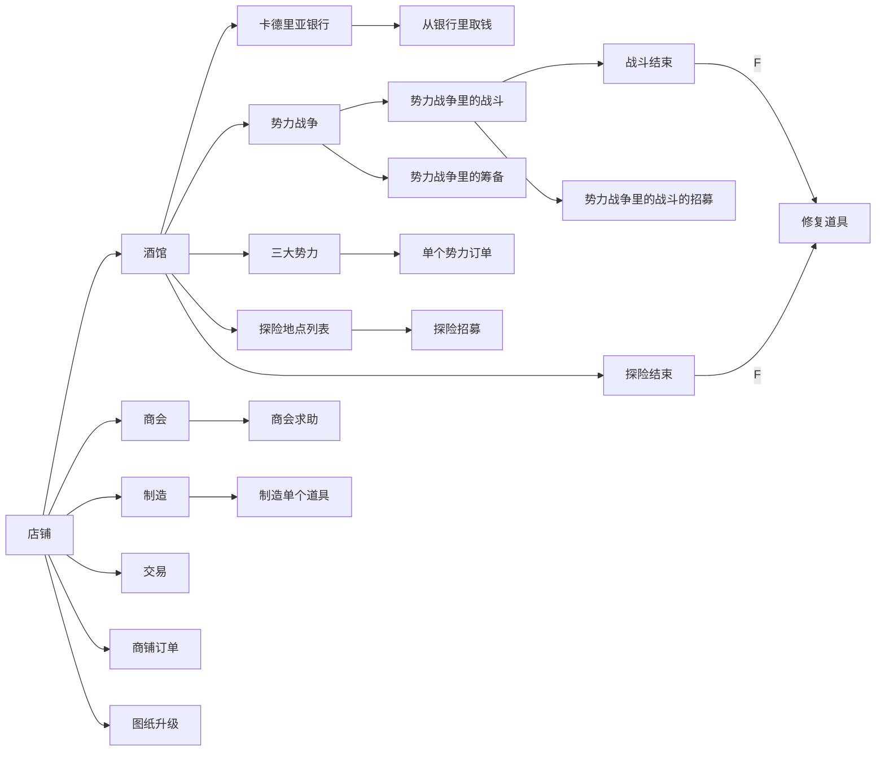
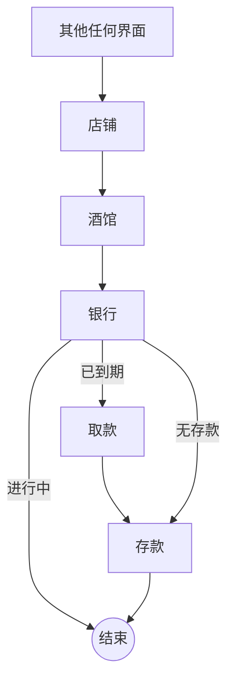
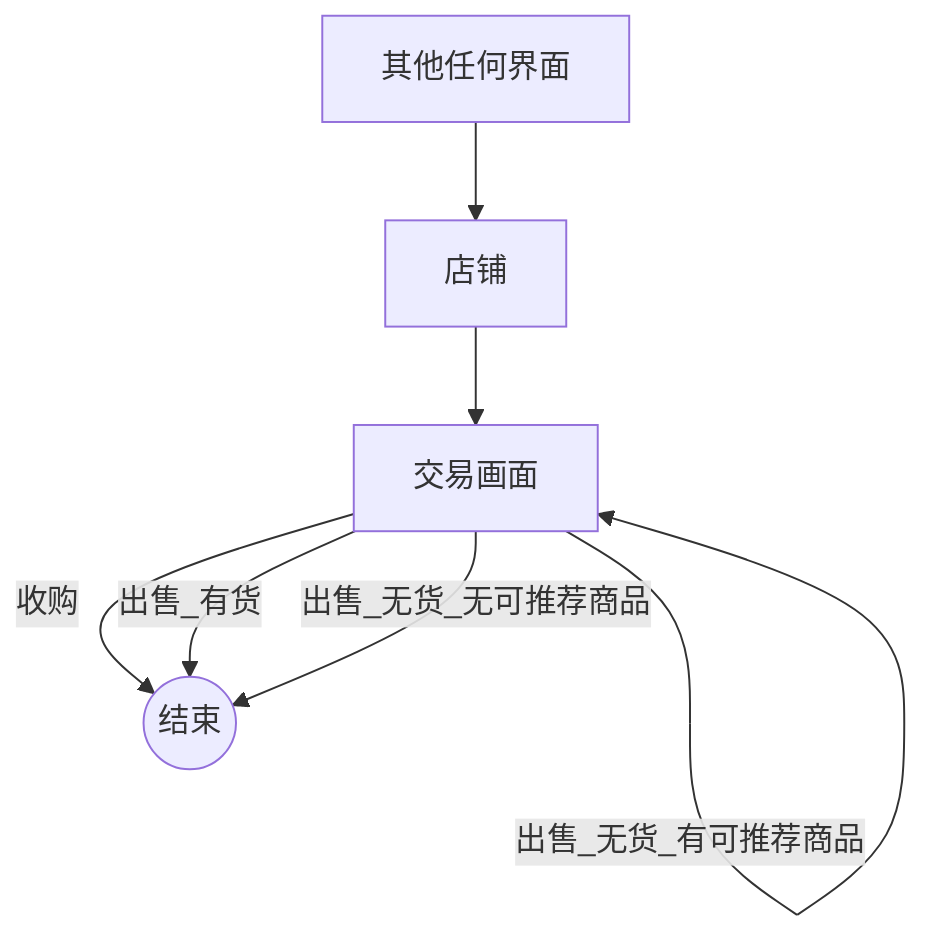
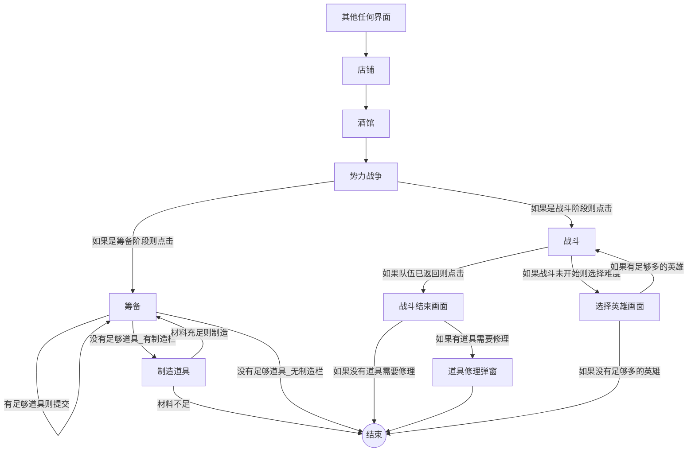

# 脚本设计

本文档记录了卡德里亚道具屋自动脚本的设计。

## 场景汇总

英文名|中文名|备注
---|---|---
Shop|店铺|
Town|城镇|店铺画面左下角按钮
Tavern|酒馆|店铺画面右下角按钮
Guild|商会|店铺左侧按钮
Deal|交易|点击店铺画面中一个人
Crafting|制造|道具列表
OrderHelp|商会求助|商会其他成员的求助
ShopOrder|商铺订单|酒馆里等着的商铺人员
Bank|卡德里亚银行|酒馆里等着的银行人员
FactionWar|势力战争|
Battle|势力战争里的战斗|有“选择难度”（未开始）和"队伍已返回“两种状态。
Preparation|势力战争里的筹备|
Factions|三大势力|左中右三个势力
FactionOrders|单个势力订单|单个势力内部
Adventure|探险|探险地点列表
AdventureRecruitment|探险招募|单个探险地点，正在招募英雄
AdventureFinished|探险结束|成功或失败；可以修复英雄道具
RepairItem|修复道具|支付修复费用的弹窗，修复道具
CraftOneItem|制造道具|制造某个道具
BlueprintUpgraded|图纸升级|制造完成一个道具后图纸升级
BattleFinished|战斗结束|势力战争中的战斗，成功或失败；可以修复英雄的道具
BattleRecruitment|势力战争里的战斗的招募|势力战争中的战斗，正在招募英雄
RetrieveInterest|从银行里取钱|在银行点击取钱按钮后弹出的浮窗，上面有数额。

## 场景跳转图

## 任务

### 银行

### 交易

### 势力战争

